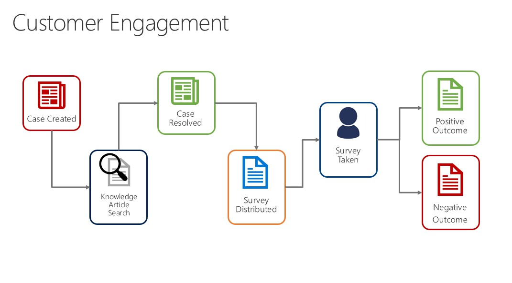
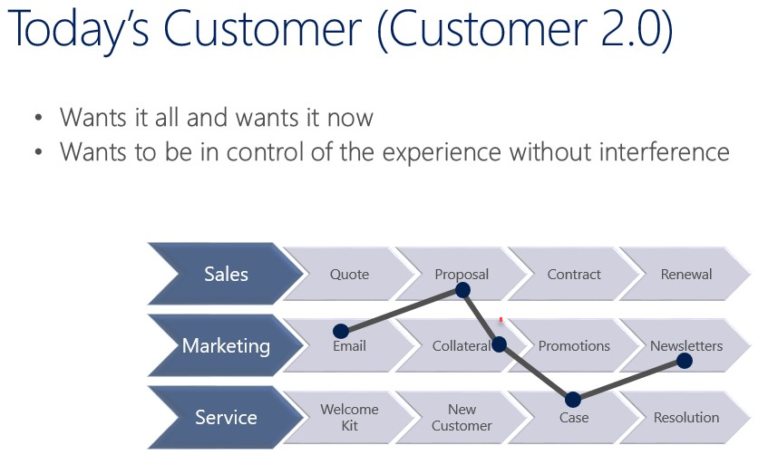

## Overview of Dynamics 365 for Customer Service

@DocYamlAuthoringDemo.sample-module.unit-2

 

    

        
        2000 XP
    

s 

<xref uid="DocYamlAuthoringDemo.sample-module.unit-2" />

A key aspect of a customer relationship @DocYamlAuthoringDemo.sample-module.unit-2 management strategy is customer service. Microsoft Dynamics 365 for Customer Service provides many features organizations use to manage the services they provide to customers

## Dynamics 365 for Customer Service  - Agent Interface

This short video shows how Dynamics 365 is used for customer service (it actually does not, just a test)

> [!VIDEO https://www.microsoft.com/en-us/videoplayer/embed/RE2DQPs]

> [!VIDEO https://www.microsoft.com/en-us/videoplayer/embed/RE2DQPq]

## Overview of Customer Service Landscape

To better understand the context of customer service, let’s review some real-life customer scenarios.

**Addressing and solving customer or product issues:**  Paul Cannon is a customer of Contoso Bicycles. He recently discovered that the suspension on his Contoso mountain bike is defective and is not functioning correctly. Paul contacts Contoso Bicycles to discuss the issue and to obtain help with his bike. The issue is logged in the Mountain Bikes Support Request Queue.

Rob is the Mountain Bikes Support Specialist for Contoso Bicycles, and receives the issue through Microsoft Dynamics 365 for Customer Service. Rob will work with Paul to schedule a service activity to repair or replace Paul’s suspension.

**Receiving and answering customer questions:**  Jim Glynn is a customer of Fabrikam Furniture. He recently received the new table he purchased through the Fabrikam website.  Although Jim tries to assemble the new table, he is not sure if he is assembling the table correctly.  Therefore, Jim contacts Fabrikam Furniture to ask questions and to obtain help with his table.

The question is received by Sidney, a Customer Support Specialist at Fabrikam Furniture.  Sidney uses the Knowledge Base in Microsoft Dynamics 365 for Customer Service to find a frequently asked questions (FAQ) document for the table. Then, Sidney uses the document to help answer Jim’s questions.

**Collecting and applying customer feedback:** Maria is the Products Manager for Tables and Chairs at Fabrikam Furniture. She wants to collect feedback about the at-home assembly process when customers contact Fabrikam.

She uses the case management functionality of Microsoft Dynamics 365 for Customer Service to capture the feedback. She is also able to analyze the tables and chairs that are more troublesome for at-home assembly, and the products that are easier to assemble. Additionally, Maria can determine the instructions that must be prioritized for editing and review for the at-home sets of tables and chairs assembly.

## Understanding today's customer

Customers today are more informed than ever.  Customer are used to having what they want at any specific time they way that they want it.

Think of going to buy a TV.  Here's the typical process:

1. Before you go to the store to purchase the item, you will probably do some research on the internet.
1. You might select multiple T.V.’s and compare the different options and features.
1. You will likely check out customer reviews and determine which one you think is best before you set foot into a store.
1. Once you are in the store, you might engage with a sales rep, but you already have a good idea as to what you are looking for.

The same can be applied across different experiences.  Customers what to be in control of the experience and prefer little or no interference as they work through the process.  It is critical that customers are given the flexibility to drive their engagement experience, but still have the option to engage with live agents under their terms.

## Trends influencing customer service

There are many different trends that are currently affecting how customer service works.  As a service organization, it is important to understand what those trends are and how to leverage them to enhance and drive the customer experience.  Some of those trends influencing service today include:

- **Mobile devices:**  With so many mobile devices available today, people are no longer engaging customer service with just a phone call or an email.  They want to be able to access portal information on their mobile devices, or engage with an agent through a chat that they initiate on their device.

- **Social media:**  People are generally not shy when it comes to expressing their thoughts and opinions on social media.  It is important to be able to leverage this platform to ensure that customer issues or complaints can be handled in the same manner as if they engaged support directly.

- **Self-service:** Self-Service can mean different things.
  - It could be as simple as providing a knowledge base that customers can leverage to find answers to simple procedural questions.
  - It could involve customers being able to manage their accounts.
  - Sometimes customers are looking for the ability to engage with other customers who are in the same situation.

- **Internet of things:**  With more and more devices connected to the internet and sending back and forth communication, it is important to leverage the technology used on these devices to engage service calls.  This could be with:
  - Anomaly detection
  - Predictive maintenance
  - Or just using the data collected to help drive service offerings in the future

- **Customer engagement**: Engagement is more than just reaching out to gain customers opinions.  It could include knowing:
  - When the right time is to engage
  - What channels should be used
  - What information should you collect