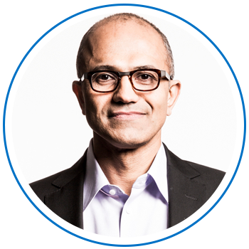

:::row:::
:::column:::

:::column-end:::
"Every industry – whether it’s oil and gas, retail, financial services, agri-tech – all are being transformed by digital technology.”
⸺*Satya Nadella, Microsoft CEO*.
:::row-end:::

Digital is reshaping how we live, work, and play. For businesses, realizing the benefits of digital transformation requires business leaders to look beyond technology. They need to reimagine existing business models and embrace different ways of bringing together people, data, and processes to create value for customers and maintain a competitive advantage for themselves. How can a business navigate this type of transformation? And how can Microsoft help?

In this module, you will learn to:

- Define digital transformation.
- Discover the outcomes businesses can achieve through digital transformation.
- Describe how Microsoft products enable digital transformation.

Let’s explore what we mean when Microsoft talks about digital transformation and walk through customer stories that illustrate how Microsoft supports digital transformation.
