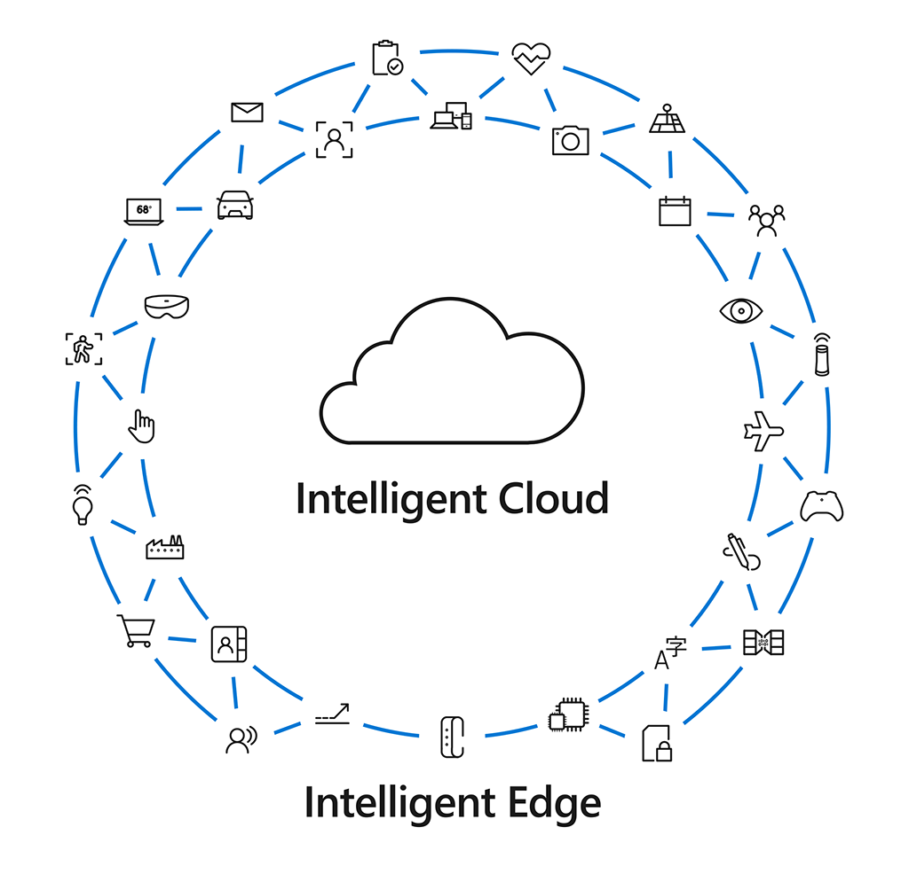

**Digital transformation** is about reimagining how you bring together people, data and processes to create value for your customers and maintain a competitive advantage in a digital-first world.

Digital technologies create new opportunities for businesses across the globe by changing the ways that goods and services are produced, sold, and consumed. These technologies help organizations  adapt in the face of competitive pressures and evolving customer needs. Doing so often involves a cultural and technological transformation that focuses on customer engagement, business processes, and data and intelligence.

Microsoft approaches impactful digital transformation across four pillars:

|  |  |  |
|---------|---------|---------|
||**Empower employees**|Help employees achieve more by creating a work environment that’s intelligent, flexible, and secure.|
||**Engage customers**|Tailor individual customer experiences by harnessing data and drawing actionable insights.|
||**Optimize operations**|Accelerate the responsiveness of your business, improve service levels, and reduce costs with intelligent processes.|
||**Transform products**|Find and capture the best new opportunities by using data as a strategic asset and shifting from hindsight to foresight.|

Organizations transform by developing new capabilities across these four pillars. By partnering with Microsoft, organizations can harness the world of ubiquitous data and computing to build innovative solutions to today’s business challenges.

Let’s dive deeper with Judson Althoff, Microsoft Executive VP, Worldwide Commercial Business, and look at how Microsoft 365, Dynamics 365, Microsoft Azure, and Microsoft’s commitment to continued innovation are delivering the most complete, most secure cloud productivity service to business customers, supporting companies on their digital transformation journey.

Watch this video from Althoff and begin to envision what it means to be digital and see the possibilities unlocked by Microsoft solutions.

> [!VIDEO https://www.microsoft.com/videoplayer/embed/RE2NI2o]

The role of Microsoft is to help organizations realize the benefits of their digital transformation.

**The digital transformation experience with Microsoft**

Microsoft enables its customers and partners across a broad spectrum of global enterprises to build cutting-edge, individualized solutions utilizing the power of the **intelligent cloud** and the **intelligent edge** to improve how they operate and compete in a rapidly changing world. The **intelligent cloud** is our ability to harness the power of the cloud and the advanced capabilities of AI. The **intelligent edge** is an expanding set of connected systems and devices that create, gather, and analyze data. Partnering with Microsoft enables businesses to unlock new capabilities and analyze and apply business intelligence in ways never before possible.

The Microsoft solution areas use the power of the intelligent cloud and intelligent edge to create empowered experiences and digital transformation across the four pillars.

:::row:::
  
:::column span="1":::
*What new capabilities would you like to create within your business or industry?
How do you think that transforming digitally might get you closer to the future you are imagining?*

*Write down three opportunities you see to transform how you serve your customers and employees as well as your organization.*
:::column-end:::
:::row-end:::

Let’s see how Microsoft is helping customers to bring digital transformation to life and realize business innovation through a closer look at two examples.